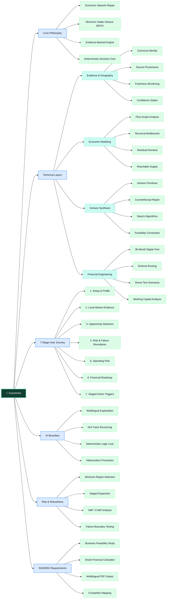
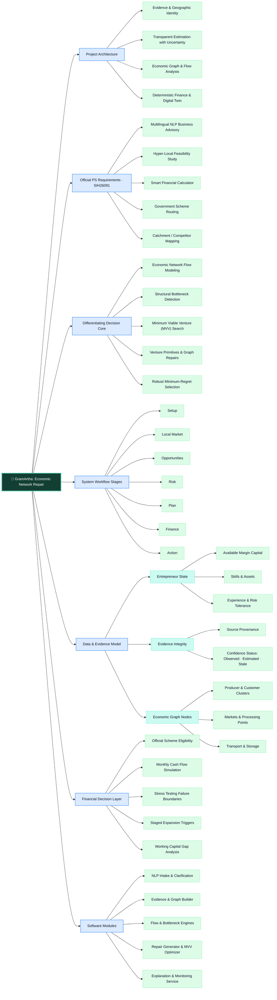

# GramArtha Architecture & System Maps

> **Purpose:** these diagrams explain the implemented business-decision architecture and economic-network system. They are **system maps**, not a future-development roadmap.

[🚀 Open the public app](https://gramartha-west-bengal.onrender.com/ui/) · [🎯 5-minute SIH judge walkthrough](docs/SIH_JUDGE_WALKTHROUGH.md) · [✅ Validation](docs/VALIDATION.md) · [🔎 Limitations](docs/LIMITATIONS.md)

---

## 1. Business & Decision Architecture

This map shows how GramArtha connects its core philosophy, technical layers, entrepreneur journey, AI boundary, robustness layer, and SIH26091-facing requirements.

### What this map communicates

- **Core philosophy:** GramArtha repairs a local economic-network gap rather than generating a generic business list.
- **Evidence discipline:** canonical identity, provenance, freshness, and confidence remain explicit inputs to the decision.
- **Venture synthesis:** candidate ventures are treated as graph repairs and tested under feasibility constraints.
- **Finance:** the recommendation is carried into a 36-month digital twin, scheme routing, stress tests, and working-capital analysis.
- **AI containment:** language AI is used for intake/explanation while the decision core remains deterministic or explicitly modelled.
- **Robustness:** the final recommendation is compared under failure boundaries, VaR/CVaR-style downside summaries, staged expansion, and minimum-regret logic.

---

## 2. Economic Network & Implementation System Map

This map focuses on how evidence becomes a local economic graph, then a differentiated venture decision and financial action.

### Decision path in one line

**Entrepreneur state + qualified local evidence → economic graph → exact flow / bottleneck → counterfactual venture repair → MVV → 36-month finance + stress → robust staged action.**

---

## Where the implementation lives

| Layer | Main repository areas |
|---|---|
| Evidence, geography, freshness | `backend/evidence/`, `backend/spatial/` |
| Economic graph, flow, bottlenecks, counterfactuals | `backend/engine/` |
| Venture synthesis / pipeline | `backend/engine/`, `backend/pipeline/` |
| Financial decision layer | `backend/finance/` |
| Multilingual presentation & reporting | `backend/presentation/`, `backend/reporting/` |
| API and product workflow | `backend/api/`, `frontend/` |
| Validation | `tests/`, `docs/VALIDATION.md` |

## Related technical references

- [`README.md`](README.md) — product-first overview and live app
- [`docs/SIH_JUDGE_WALKTHROUGH.md`](docs/SIH_JUDGE_WALKTHROUGH.md) — judge-oriented 5-minute demo path
- [`docs/IMPLEMENTATION_STATUS.md`](docs/IMPLEMENTATION_STATUS.md) — implemented vs. limited surfaces
- [`docs/DATA_ARCHITECTURE.md`](docs/DATA_ARCHITECTURE.md) — provenance and rebuild path
- [`docs/LIMITATIONS.md`](docs/LIMITATIONS.md) — evidence and modelling caveats
- [`DATA_LICENSES.md`](DATA_LICENSES.md) — data/asset licensing boundaries
