<div align="center">

# GramArtha

### Evidence-backed hyper-local business advisory and financial structuring for West Bengal

**Smart India Hackathon 2026 · SIH26091 · v0.7.2**

[](https://github.com/tapandutta46779-bit/gramartha-west-bengal/actions/workflows/ci.yml)
[](https://github.com/tapandutta46779-bit/gramartha-west-bengal/actions/workflows/security.yml)
[](https://github.com/tapandutta46779-bit/gramartha-west-bengal/actions/workflows/dependency-review.yml)
[](https://www.python.org/)
[](https://fastapi.tiangolo.com/)
[](LICENSE)

</div>

GramArtha is a deterministic decision engine for rural and hyper-local micro-enterprise planning. It combines evidence provenance, geographic resolution, uncertainty-aware estimation, economic-network optimization, finance screening, a 36-month digital twin, stress testing, robust alternative selection, and multilingual reporting.

The central rule is simple: **the system must not turn stale, sampled, missing, or modelled evidence into fabricated present-day facts.**

## At a glance

| Capability | Repository-verified implementation |
|---|---|
| Geographic/evidence layer | 53,537 geographic identities and 381,523 locality evidence records in the audited implementation snapshot |
| Survey priors | 976 regional priors; restricted HCES/ASUSE microdata are not redistributed in the public runtime |
| Spatial context | West Bengal OSM-derived road and POI context with explicit volunteered-data completeness caveats |
| Decision engine | Exact flow, bottleneck ranking, counterfactuals and Minimum Viable Venture search over the enumerated venture library |
| Finance | Scheme screening, loan calculations, 36-month cash-flow digital twin, break-even and payback |
| Uncertainty | 512 deterministic seeded triangular joint scenarios, survival/payback summaries, VaR/CVaR and regret-based robustness |
| Validation | Pytest suite, real West Bengal E2E cases and a 23-district smoke run |
| Product | Seven-stage web workflow, FastAPI contract, English/Bengali/Hindi reporting and PDF export |
| Deployment | Render configuration plus public-safe compressed runtime databases |

Detailed evidence and caveats live in [`docs/`](docs/), especially [`docs/IMPLEMENTATION_STATUS.md`](docs/IMPLEMENTATION_STATUS.md), [`docs/LIMITATIONS.md`](docs/LIMITATIONS.md), and [`docs/VALIDATION.md`](docs/VALIDATION.md).

## Product preview

<table>
<tr>
<td width="50%"></td>
<td width="50%"></td>
</tr>
<tr>
<td align="center"><b>Hyper-local spatial context</b></td>
<td align="center"><b>Evidence-backed venture summary</b></td>
</tr>
</table>

<p align="center">
  
</p>

## How a decision is produced

```mermaid
flowchart LR
    U[Entrepreneur input<br/>location · capital · sector] --> UI[Seven-stage web UI]
    UI --> API[FastAPI]
    API --> GEO[Geography resolver]
    GEO --> EVID[Evidence + freshness gates]
    EVID --> SPATIAL[OSM catchment / local context]
    EVID --> PRIORS[HCES / ASUSE / official priors]
    SPATIAL --> GRAPH[Economic graph]
    PRIORS --> EST[Transparent estimation + uncertainty]
    EST --> GRAPH
    GRAPH --> FLOW[Exact flow + bottleneck + counterfactual]
    FLOW --> MVV[Minimum Viable Venture search]
    MVV --> FIN[Finance + 36-month digital twin]
    FIN --> RISK[Stress + 512-scenario robustness]
    RISK --> DECISION[Canonical VentureDecision]
    DECISION --> REPORT[English · Bengali · Hindi<br/>browser + PDF]
    LLM[Optional LLM] -. explanation/structuring only .-> REPORT
```



### AI boundary

GramArtha is deliberately **not an LLM that invents a business recommendation**.

- Evidence retrieval, geography, calculations, flow, finance, uncertainty and venture selection remain deterministic or explicitly modelled.
- An LLM may structure user input or explain a **frozen** `VentureDecision`.
- An LLM must not invent evidence, silently change financial assumptions, calculate hidden finance, or replace the selected venture.
- When required current evidence is absent, the engine is expected to gate or qualify the result rather than fabricate precision.

## Repository map

```text
backend/
  api/             FastAPI contract and endpoints
  engine/          flow, bottleneck, counterfactual, MVV, robustness, uncertainty
  evidence/        geography, freshness, evidence store and adapters
  finance/         calculations, finance rules, digital twin and stress
  pipeline/        automatic decision pipeline and sector adapters
  presentation/    multilingual plain-language rendering
  reporting/       PDF generation and licensed fonts
  spatial/         OSM spatial runtime

frontend/          seven-stage browser product
scripts/           acquisition, ingestion, audits, validation and packaging
tests/             automated correctness tests
docs/              methodology, limitations, audits and data architecture
deploy/            public-safe production runtime
```

## Quick start

Requires **Python 3.12+**.

```bash
python3 -m venv .venv
source .venv/bin/activate
python -m pip install --upgrade pip
python -m pip install -e '.[dev]'
```

To start the public-safe runtime included in the repository:

```bash
bash deploy/start.sh
```

Then open:

- `http://127.0.0.1:10000/ui/` — product UI
- `http://127.0.0.1:10000/docs` — FastAPI/OpenAPI contract
- `http://127.0.0.1:10000/health` — health check

On macOS, `Open GramArtha.command` is also provided for the local full-data workflow.

## Verification

The same baseline checks used by CI can be run locally:

```bash
ruff check backend scripts tests deploy
pytest
python -m compileall -q backend scripts deploy
node --check frontend/app.js
```

CI also verifies that the release version in `pyproject.toml`, FastAPI and this README stay synchronized, prepares the public runtime, checks SQLite integrity, and smoke-tests the `/health` endpoint.

## Data provenance and licensing

GramArtha mixes original source code with third-party/open datasets, official-source material, derived aggregates and bundled fonts. **The MIT license does not relicense third-party data or assets.**

See:

- [`DATA_LICENSES.md`](DATA_LICENSES.md) — dataset and asset licensing boundaries
- [`NOTICE.md`](NOTICE.md) — attribution notices
- [`docs/DATA_ARCHITECTURE.md`](docs/DATA_ARCHITECTURE.md) — rebuild/provenance path
- [`docs/DATA_SOURCES_ACQUIRED.md`](docs/DATA_SOURCES_ACQUIRED.md) — acquired-source inventory
- [`docs/MICRODATA_IMPORT.md`](docs/MICRODATA_IMPORT.md) — restricted survey handling

Public deployment assets intentionally exclude restricted respondent microdata and private fitted model artifacts.

## Security and maintenance

The repository includes:

- CI for Ruff, pytest, Python compilation, JavaScript syntax, runtime preparation and API smoke tests
- CodeQL analysis for Python and JavaScript
- `pip-audit` dependency vulnerability checks
- high-severity Bandit checks
- Gitleaks advisory secret scanning
- pull-request dependency review
- Dependabot updates for Python and GitHub Actions
- CODEOWNERS, issue templates and a PR integrity checklist
- tagged release automation with SHA-256 checksums

Security reports should follow [`SECURITY.md`](SECURITY.md). Please do **not** publish credentials, restricted microdata, personal data or exploit details in a public issue.

## Deployment

[`render.yaml`](render.yaml) defines the HTTPS service, automatic deploy-on-commit behavior and `/health` health check. [`deploy/start.sh`](deploy/start.sh) reconstructs the public-safe runtime databases and starts the API.

The public runtime is designed to remain reproducible without shipping restricted HCES/ASUSE respondent microdata or private fitted model artifacts.

## Known limitations

GramArtha is a decision-support and planning system, not a lender, official statistics publisher, or guarantee of business viability. Historical observations remain historical; OSM completeness varies; generic outputs can be modelled planning benchmarks; scenario probabilities are not claimed to be empirically calibrated.

Read [`docs/LIMITATIONS.md`](docs/LIMITATIONS.md) before treating an output as decision-ready.

## Contributing

Please read [`CONTRIBUTING.md`](CONTRIBUTING.md) before opening a pull request. Data changes require source, license/terms, observation date, freshness classification and reproducibility information.

See [`CONTRIBUTORS.md`](CONTRIBUTORS.md) for project contributors, including **[@tapandutta46779](https://github.com/tapandutta46779)**.

## License

Original GramArtha source code is released under the [MIT License](LICENSE).

Third-party datasets, derived OSM material, official-source documents and bundled fonts remain subject to their own terms. See [`DATA_LICENSES.md`](DATA_LICENSES.md) and [`NOTICE.md`](NOTICE.md).
