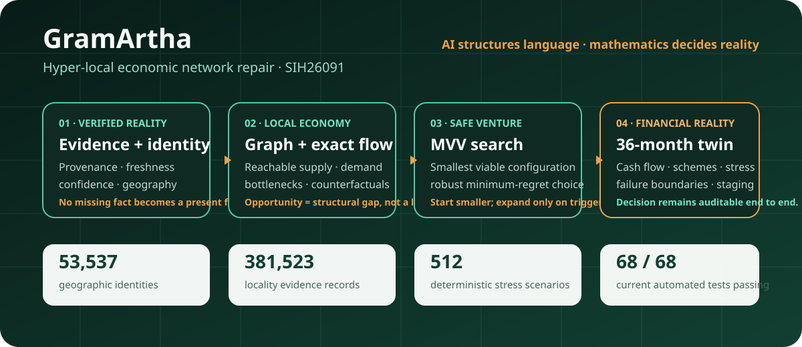
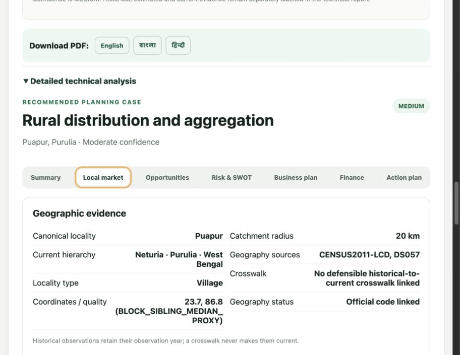
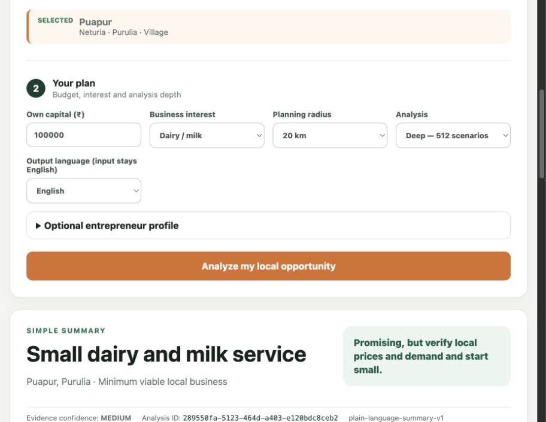
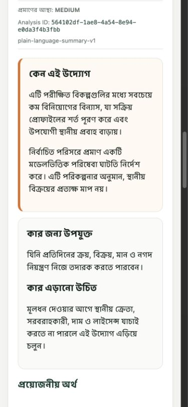

<div align="center">

# 🌾 GramArtha

### Hyper-local economic network repair for rural micro-entrepreneurs

**Evidence → local economic graph → structural gap → minimum viable venture → 36-month financial reality → staged action**

**Smart India Hackathon 2026 · SIH26091 · v0.7.2**

<br>


[](https://github.com/tapandutta46779-bit/gramartha-west-bengal/actions/workflows/ci.yml)
[](https://github.com/tapandutta46779-bit/gramartha-west-bengal/actions/workflows/security.yml)
[](https://github.com/tapandutta46779-bit/gramartha-west-bengal/actions/workflows/dependency-review.yml)

<br>

[](../../releases/latest)
[](docs/SIH_JUDGE_WALKTHROUGH.md)
[](docs/VALIDATION.md)
[](docs/LIMITATIONS.md)

<br>


**Contributor: [Mohit Dutta](https://github.com/tapandutta46779) · [@tapandutta46779](https://github.com/tapandutta46779)**

</div>

---

<p align="center">
  
</p>

> **GramArtha is not a chatbot that guesses a business name.** It is an evidence-backed decision engine that asks a harder question: *what structural gap exists in this local economy, what is the smallest venture that can repair it, and does that venture survive financial stress for this entrepreneur?*

The system keeps language AI at the edge. Geography, evidence status, market structure, economic flow, venture selection, finance, uncertainty and robust ranking are deterministic or explicitly modelled. If evidence is stale, sampled, missing or modelled, GramArtha preserves that state instead of silently presenting it as a current local fact.

---

## ⚡ 60-second judge view

<table>
<tr>
<td width="25%" valign="top"><b>📍 Start with reality</b><br><br>Resolve the entrepreneur to a canonical West Bengal geography, preserve provenance and confidence, and qualify stale or incomplete evidence.</td>
<td width="25%" valign="top"><b>🕸️ Model the local economy</b><br><br>Build economic relationships, reachable supply and demand, exact flow, residual unserved demand and structural bottlenecks.</td>
<td width="25%" valign="top"><b>🧩 Repair, do not list</b><br><br>Insert venture primitives, recompute the graph and search for the Minimum Viable Venture rather than returning a generic business list.</td>
<td width="25%" valign="top"><b>₹ Test financial reality</b><br><br>Screen schemes, simulate 36 months, stress adverse conditions, compare regret and stage expansion behind measurable triggers.</td>
</tr>
</table>

### What is already repository-verifiable

| Proof surface | Current implementation |
|---|---|
| **Geographic/evidence layer** | **53,537** geographic identities and **381,523** locality evidence records in the audited implementation snapshot |
| **Survey priors** | **976** regional priors; restricted HCES/ASUSE respondent microdata are not redistributed in the public runtime |
| **Spatial context** | West Bengal OSM-derived roads/POIs with explicit volunteered-data completeness caveats |
| **Decision core** | Exact flow, bottleneck ranking, counterfactual recomputation, venture primitives and Minimum Viable Venture search |
| **Finance** | Scheme screening, loan calculations, **36-month** cash-flow digital twin, break-even/payback and working-capital analysis |
| **Uncertainty** | **512** deterministic seeded triangular joint scenarios, survival/payback summaries, VaR/CVaR and regret-based robustness |
| **Validation** | **68 automated tests passing** on current CI, plus real West Bengal E2E cases and a 23-district smoke run |
| **Product** | Seven-stage web workflow, FastAPI contract, English/Bengali/Hindi output and PDF export |
| **Deployment** | Render configuration plus reproducible public-safe compressed runtime databases |

---

## 🎬 Product preview

<table>
<tr>
<th width="50%">Hyper-local market context</th>
<th width="50%">Decision summary</th>
</tr>
<tr>
<td></td>
<td></td>
</tr>
<tr>
<td><b>Evidence before recommendation.</b><br>Canonical geography, OSM context and local evidence remain visible instead of disappearing behind a score.</td>
<td><b>A decision, not a paragraph.</b><br>The output exposes venture structure, finance, risk and action rather than only natural-language advice.</td>
</tr>
</table>

<p align="center">
  
</p>

<p align="center"><b>Responsive multilingual output — English · বাংলা · हिन्दी</b></p>

---

## 🧭 The 7-stage user journey

| Stage | What the entrepreneur sees | What the engine is doing underneath |
|---|---|---|
| **1 · Setup** | Locality, capital and optional entrepreneur profile | Canonical geography + constraints |
| **2 · Local Market** | Evidence, catchment and local context | Provenance, confidence, OSM and survey priors |
| **3 · Opportunities** | Structural gaps worth testing | Graph construction, flow and bottleneck detection |
| **4 · Risk** | What can break the venture | Scenario stress, uncertainty and failure boundaries |
| **5 · Plan** | Smallest viable operating configuration | Counterfactual repair + MVV search |
| **6 · Finance** | Loan/scheme fit and monthly cash reality | Rules, EMI, 36-month digital twin, working capital |
| **7 · Action** | Staged launch and expansion triggers | Robust selection + measurable trigger conditions |

---

## 🧠 Why this is structurally different from a standard AI business advisor

| Question | Typical text-first assistant | GramArtha |
|---|---|---|
| **Market reach** | Radius/population overlap | Reachable economic context using spatial and network evidence |
| **Competition** | “Few nearby competitors = opportunity” | Supply/demand overlap, capacity, residual demand and cannibalization logic |
| **Opportunity** | Generic generated list | Structural bottleneck → candidate repair → counterfactual recomputation |
| **Venture size** | Start a category/business | Search the **Minimum Viable Venture** that satisfies constraints |
| **Finance** | Static EMI / optimistic projection | Scheme rules + 36-month monthly digital twin + working-capital gaps |
| **Risk** | SWOT / vague labels | Stress scenarios, failure boundaries, VaR/CVaR and minimum-regret comparison |
| **Evidence** | Often flattened into prose | Observed / estimated / stale / conflicting states with provenance |
| **AI role** | May generate the decision | May structure intake/explain output; cannot silently alter the frozen decision |

---

## 🔄 How a decision is produced

```mermaid
flowchart LR
    U["Entrepreneur\nlocation · capital · profile"] --> UI["7-stage web product"]
    UI --> GEO["Canonical geography"]
    GEO --> EVID["Evidence + freshness + confidence"]
    EVID --> SPATIAL["OSM / catchment context"]
    EVID --> PRIORS["Official / survey priors"]
    SPATIAL --> GRAPH["Economic graph"]
    PRIORS --> EST["Transparent estimation + uncertainty"]
    EST --> GRAPH
    GRAPH --> FLOW["Exact flow + bottlenecks"]
    FLOW --> CF["Counterfactual repair"]
    CF --> MVV["Minimum Viable Venture"]
    MVV --> FIN["Schemes + 36-month digital twin"]
    FIN --> STRESS["512 scenarios + failure boundaries"]
    STRESS --> ROBUST["Minimum-regret / robust selection"]
    ROBUST --> D["Frozen VentureDecision"]
    D --> OUT["English · Bengali · Hindi\nweb + PDF + staged action"]
    LLM["Optional language AI"] -. "structure / explain only" .-> UI
    LLM -. "explain frozen decision" .-> OUT
```



### Strict AI containment boundary

```text
Natural language input
        │
        ▼
 optional AI / NLP structuring
        │
        ▼
┌───────────────────────────────────────────┐
│       DETERMINISTIC DECISION CORE         │
│ evidence → graph → flow → MVV → finance   │
│ uncertainty → robust selection            │
└───────────────────────────────────────────┘
        │
        ▼
      VentureDecision  ← frozen
        │
        ▼
 optional multilingual explanation
```

The LLM boundary is deliberate: it must not invent market evidence, perform hidden loan arithmetic, change venture assumptions, replace the selected venture or convert weak evidence into certainty.

---

## 🧱 Four technical layers

<table>
<tr>
<td width="25%" valign="top"><b>1 · Evidence & geographic identity</b><br><br><code>backend/evidence/</code><br><code>backend/spatial/</code><br><br>Canonical location, source provenance, freshness, evidence gates, OSM context.</td>
<td width="25%" valign="top"><b>2 · Economic graph & exact flow</b><br><br><code>backend/engine/</code><br><br>Flow, bottlenecks, counterfactuals, reachable supply and structural gaps.</td>
<td width="25%" valign="top"><b>3 · Venture repair & MVV</b><br><br><code>backend/engine/</code><br><code>backend/pipeline/</code><br><br>Venture primitives, graph repairs, enumerated candidate search and robust ranking.</td>
<td width="25%" valign="top"><b>4 · Finance & digital twin</b><br><br><code>backend/finance/</code><br><br>Scheme rules, EMI, monthly cash flow, stress, working capital and staged expansion.</td>
</tr>
</table>

---

## 🎯 SIH26091 requirement mapping

| Problem-statement need | GramArtha implementation | Judge-visible proof |
|---|---|---|
| **Multilingual advisory** | English/Bengali/Hindi presentation and PDF reporting | Product UI + multilingual screenshots |
| **Hyper-local feasibility** | Canonical geography, evidence store, spatial context and explicit confidence/freshness | Local Market stage + audit trail |
| **Financial structuring** | Scheme screening, loan arithmetic, monthly digital twin, break-even/payback | Finance stage + decision output |
| **Government scheme routing** | Explicit eligibility/rule layer rather than free-form LLM advice | Finance rules + generated plan |
| **Catchment / competitor context** | OSM-derived spatial context with completeness caveats | Transport/OSM validation screenshot |
| **Decision support under uncertainty** | 512 deterministic scenarios, failure boundaries and robust/minimum-regret selection | Risk stage + validation docs |
| **Actionable business recommendation** | Minimum Viable Venture + staged expansion triggers | Plan and Action stages |

---

## 🔬 Evidence model: confidence is part of the data

GramArtha does not treat every number as equally real. Evidence carries its source and status, including distinctions such as **observed**, **estimated**, **stale** or **conflicting**. Lower-confidence inputs widen stress ranges or qualify the decision rather than masquerading as precise present-day knowledge.

The public runtime intentionally does **not** redistribute restricted respondent microdata or private fitted model artifacts. Rebuild paths, licenses and caveats are documented instead.

Key references:

- [`docs/IMPLEMENTATION_STATUS.md`](docs/IMPLEMENTATION_STATUS.md) — what is implemented and what is not
- [`docs/VALIDATION.md`](docs/VALIDATION.md) — automated and end-to-end validation
- [`docs/LIMITATIONS.md`](docs/LIMITATIONS.md) — evidence, calibration and product limitations
- [`docs/DATA_ARCHITECTURE.md`](docs/DATA_ARCHITECTURE.md) — provenance and rebuild design
- [`docs/DATA_SOURCES_ACQUIRED.md`](docs/DATA_SOURCES_ACQUIRED.md) — acquired-source inventory
- [`DATA_LICENSES.md`](DATA_LICENSES.md) — dataset/asset licensing boundaries

---

## 🏁 Five-minute judge demo

For the shortest useful evaluation path, open **[`docs/SIH_JUDGE_WALKTHROUGH.md`](docs/SIH_JUDGE_WALKTHROUGH.md)**.

The sequence is intentionally evidence-first:

1. Select a West Bengal district and canonical locality.
2. Show the Local Market evidence/context before any recommendation.
3. Run **Deep — 512 scenarios**.
4. Open the recommendation and explain the structural gap / MVV logic.
5. Show monthly finance, downside/failure information and staged action.
6. Expand **“How did GramArtha decide?”** to inspect evidence and methodology.

---

## 🚀 Run it

Requires **Python 3.12+**.

```bash
python3 -m venv .venv
source .venv/bin/activate
python -m pip install --upgrade pip
python -m pip install -e '.[dev]'
bash deploy/start.sh
```

Then open:

- `http://127.0.0.1:10000/ui/` — GramArtha product
- `http://127.0.0.1:10000/docs` — FastAPI / OpenAPI contract
- `http://127.0.0.1:10000/health` — service health

On macOS, `Open GramArtha.command` is also provided for the local full-data workflow.

---

## ✅ Verification and engineering quality

The current CI runs the same baseline checks a reviewer can run locally:

```bash
ruff check backend scripts tests deploy
pytest
python -m compileall -q backend scripts deploy
node --check frontend/app.js
```

Current CI result: **68 passed**. The workflow also prepares the public runtime data, checks SQLite integrity, smoke-tests `/health`, and verifies version consistency.

Security automation includes CodeQL for Python/JavaScript, `pip-audit`, high-severity Bandit checks, advisory Gitleaks scanning and a portable third-party dependency audit. A dependency scan during repository hardening identified a vulnerable pytest release; the project was upgraded to the patched pytest 9 line and the complete suite passed afterwards.

---

## 📂 Repository map

```text
backend/
  api/             FastAPI contract and endpoints
  engine/          flow, bottleneck, counterfactual, MVV, robustness, uncertainty
  evidence/        geography, freshness, evidence store and adapters
  finance/         calculations, finance rules, digital twin and stress
  pipeline/        automatic decision pipeline and sector adapters
  presentation/    multilingual plain-language rendering
  reporting/       PDF generation and licensed fonts
  spatial/         OSM spatial runtime

frontend/          seven-stage browser product
scripts/           acquisition, ingestion, audits, validation and packaging
tests/             automated correctness tests
docs/              methodology, judge guide, limitations, audits, data architecture
deploy/            public-safe production runtime
deliverables/      public-share packages and implementation report
```

---

## ⚠️ What GramArtha does **not** claim

GramArtha is a planning and decision-support system, not a lender, official statistics publisher or guarantee of business viability. Historical observations remain historical. OSM completeness varies. Generic outputs can contain modelled planning benchmarks. Scenario probabilities are not claimed to be empirically calibrated unless explicitly documented.

That restraint is part of the architecture: **the system must not turn stale, sampled, missing or modelled evidence into fabricated present-day facts.**

Read [`docs/LIMITATIONS.md`](docs/LIMITATIONS.md) before treating any output as decision-ready.

---

## 🔐 Data, security and licensing

Original GramArtha source code is released under the [MIT License](LICENSE). Third-party datasets, derived OSM material, official-source documents and bundled fonts remain subject to their own terms. The MIT license does not relicense those assets.

See [`DATA_LICENSES.md`](DATA_LICENSES.md), [`NOTICE.md`](NOTICE.md) and [`SECURITY.md`](SECURITY.md).

---

## 👤 Contributor

**Mohit Dutta — [@tapandutta46779](https://github.com/tapandutta46779)**

See [`CONTRIBUTORS.md`](CONTRIBUTORS.md) and [`CITATION.cff`](CITATION.cff) for attribution/citation metadata.

---

<div align="center">

### **Explored by AI at the language boundary. Decided by evidence, graphs and mathematics.**

</div>
