<div align="center">

# 🌾 GramArtha

### Hyper-local economic network repair for rural micro-entrepreneurs

**Evidence → local economic graph → structural gap → minimum viable venture → 36-month financial reality → staged action**

**Smart India Hackathon 2026 · SIH26091 · v0.7.2**

<br>


[](https://github.com/tapandutta46779-bit/gramartha-west-bengal/actions/workflows/ci.yml)
[](https://github.com/tapandutta46779-bit/gramartha-west-bengal/actions/workflows/security.yml)
[](https://github.com/tapandutta46779-bit/gramartha-west-bengal/actions/workflows/dependency-review.yml)

<br>

[](https://gramartha-west-bengal.onrender.com/ui/)
[](docs/SIH_JUDGE_WALKTHROUGH.md)
[](ARCHITECTURE.md)
[](docs/README.md)
[](../../releases/tag/sih2026-demo-videos-v1)
[](docs/VALIDATION.md)

<br>


**Contributor: [Mohit Dutta](https://github.com/tapandutta46779) · [@tapandutta46779](https://github.com/tapandutta46779)**

</div>

---

<p align="center">
  
</p>

> **GramArtha is not a chatbot that guesses a business name.** It asks a harder question: *what structural gap exists in this local economy, what is the smallest venture that can repair it, and does that venture survive financial stress for this entrepreneur?*

Language AI stays at the edge. Geography, evidence status, economic flow, venture selection, finance, uncertainty and robust ranking are deterministic or explicitly modelled. Weak, stale or missing evidence is preserved as such instead of being silently converted into a precise present-day fact.

## ⚡ Choose the fastest path

<table>
<tr>
<td width="33%" valign="top"><b>🚀 Try the product</b><br><br>Open the public application, choose a West Bengal locality and run a real analysis.<br><br><a href="https://gramartha-west-bengal.onrender.com/ui/"><b>Open live GramArtha →</b></a></td>
<td width="33%" valign="top"><b>🎯 Judge it in 5 minutes</b><br><br>Follow the evidence-first SIH walkthrough from locality resolution to finance and audit trail.<br><br><a href="docs/SIH_JUDGE_WALKTHROUGH.md"><b>Open judge walkthrough →</b></a></td>
<td width="33%" valign="top"><b>🔬 Audit the engineering</b><br><br>Inspect architecture, implementation status, validation, limitations, data provenance and CI quality gates.<br><br><a href="docs/README.md"><b>Open documentation index →</b></a></td>
</tr>
</table>

---

## 🧭 What happens to one request

<table>
<tr>
<td width="25%" valign="top"><b>01 · Verified reality</b><br><br>Canonical geography, source provenance, freshness and confidence.</td>
<td width="25%" valign="top"><b>02 · Local economy</b><br><br>Reachable supply/demand, exact flow, residual demand and structural bottlenecks.</td>
<td width="25%" valign="top"><b>03 · Safe venture</b><br><br>Counterfactual graph repairs and Minimum Viable Venture search.</td>
<td width="25%" valign="top"><b>04 · Financial reality</b><br><br>Scheme rules, 36-month digital twin, stress, failure boundaries and staged action.</td>
</tr>
</table>

### Repository-verifiable scale

| Proof surface | Current implementation |
|---|---|
| **Geographic/evidence layer** | **53,537** geographic identities and **381,523** locality evidence records in the audited implementation snapshot |
| **Survey priors** | **976** regional priors; restricted HCES/ASUSE respondent microdata are not redistributed in the public runtime |
| **Decision core** | Exact flow, bottleneck ranking, counterfactual recomputation, venture primitives and enumerated Minimum Viable Venture search |
| **Finance** | Scheme screening, loan calculations, **36-month** monthly cash-flow digital twin, break-even/payback and working-capital analysis |
| **Uncertainty** | **512** deterministic seeded triangular joint scenarios, survival/payback summaries, VaR/CVaR and regret-based robustness |
| **Validation** | **68/68 tests passing**, **81.6% backend line coverage**, **61.4% branch coverage**, real West Bengal E2E cases and district smoke validation |
| **Product** | Seven-stage web workflow, FastAPI contract, English/Bengali/Hindi output, PDF export and public deployment |

---

## 🎬 Product preview

<table>
<tr>
<th width="50%">Hyper-local market context</th>
<th width="50%">Decision summary</th>
</tr>
<tr>
<td></td>
<td></td>
</tr>
<tr>
<td><b>Evidence before recommendation.</b><br>Canonical geography, spatial context and local evidence remain visible instead of disappearing behind a score.</td>
<td><b>A decision, not a paragraph.</b><br>The output exposes venture structure, finance, risk and action rather than only natural-language advice.</td>
</tr>
</table>

<p align="center">
  
  <br><b>Responsive multilingual output — English · বাংলা · हिन्दी</b>
</p>

---

## 🔄 Decision architecture

```mermaid
flowchart LR
    U["Entrepreneur\nlocation · capital · profile"] --> GEO["Canonical geography"]
    GEO --> EVID["Evidence\nprovenance · freshness · confidence"]
    EVID --> GRAPH["Economic graph"]
    GRAPH --> FLOW["Exact flow\n+ bottlenecks"]
    FLOW --> CF["Counterfactual repair"]
    CF --> MVV["Minimum Viable Venture"]
    MVV --> FIN["Schemes + 36-month twin"]
    FIN --> STRESS["512 scenarios\n+ failure boundaries"]
    STRESS --> ROBUST["Robust / minimum-regret choice"]
    ROBUST --> D["Frozen VentureDecision"]
    D --> OUT["Web · PDF · staged action"]
    LLM["Optional language AI"] -. "structure input / explain frozen output" .-> OUT
```



The complete **Business & Decision Architecture** and **Economic Network & Implementation System Map** are in [`ARCHITECTURE.md`](ARCHITECTURE.md).

### Strict AI containment boundary

```text
language input
    │
    ▼
optional structuring
    │
    ▼
┌─────────────────────────────────────────┐
│        DETERMINISTIC DECISION CORE      │
│ evidence → graph → flow → MVV → finance │
│ uncertainty → robust selection          │
└─────────────────────────────────────────┘
    │
    ▼
frozen VentureDecision
    │
    ▼
optional multilingual explanation
```

The LLM must not invent market evidence, perform hidden loan arithmetic, replace the selected venture or turn weak evidence into certainty.

---

## 🧠 Why this is not a standard text-first business advisor

| Question | Text-first assistant | GramArtha |
|---|---|---|
| **Market reach** | Radius/population overlap | Reachable economic context using spatial and network evidence |
| **Competition** | “Few nearby competitors = opportunity” | Supply/demand overlap, capacity, residual demand and cannibalization logic |
| **Opportunity** | Generated list | Structural bottleneck → candidate repair → counterfactual recomputation |
| **Venture size** | Start a category | Search the **Minimum Viable Venture** satisfying constraints |
| **Finance** | Static EMI / projection | Scheme rules + monthly digital twin + working-capital gaps |
| **Risk** | SWOT / labels | Stress scenarios, failure boundaries, VaR/CVaR and minimum-regret comparison |
| **Evidence** | Flattened into prose | Observed / estimated / stale / conflicting states with provenance |
| **AI role** | May generate the decision | May structure/explain; cannot silently alter the frozen decision |

---

## 🎯 SIH26091 requirement mapping

| Problem-statement need | GramArtha implementation | Judge-visible proof |
|---|---|---|
| Multilingual advisory | English/Bengali/Hindi presentation + PDF | UI and multilingual output |
| Hyper-local feasibility | Canonical geography, evidence store, OSM context, confidence/freshness | Local Market + audit trail |
| Financial structuring | Scheme screening, loan arithmetic, monthly twin, break-even/payback | Finance stage |
| Government scheme routing | Explicit eligibility/rule layer | Finance rules + generated plan |
| Catchment / competitor context | OSM-derived spatial context with completeness caveats | Market evidence |
| Decision support under uncertainty | 512 scenarios, failure boundaries, robust/minimum-regret selection | Risk + validation |
| Actionable recommendation | MVV + staged expansion triggers | Plan + Action |

---

## ✅ Engineering quality is measured, not implied

Current `main` quality gate:

- **68/68 automated tests pass**.
- **81.6% backend line coverage** and **61.4% branch coverage** on the current measured baseline.
- CI enforces a **minimum 75% combined coverage gate** so coverage cannot silently collapse below the accepted baseline.
- Ruff, Python compilation and frontend JavaScript syntax checks run on every push/PR.
- Public runtime databases are reconstructed and checked with SQLite `PRAGMA integrity_check`.
- FastAPI is smoke-tested through `/health` against the reconstructed public runtime.
- Repository hygiene and local Markdown links are validated automatically.
- Every CI run publishes XML + HTML coverage as a downloadable `backend-coverage` artifact.

Security automation runs **CodeQL (Python + JavaScript), pip-audit, Bandit and Gitleaks**. Dependency auditing is separate and blocking for known third-party vulnerabilities.

[Inspect the CI workflow →](.github/workflows/ci.yml) · [Security policy →](SECURITY.md) · [Validation evidence →](docs/VALIDATION.md)

---

## 📦 Release integrity

GramArtha keeps demo media and software releases conceptually separate. The current `sih2026-demo-videos-v1` release is **presentation media**, not a software-version claim.

For every semantic version tag (`v*.*.*`), the release workflow is designed to:

1. rerun lint, compilation, tests and the coverage gate;
2. rebuild and integrity-check the public runtime databases;
3. build Python wheel + source distribution;
4. smoke-install the built wheel in a fresh environment;
5. build a public-safe runtime archive that excludes restricted/raw evidence surfaces;
6. generate a CycloneDX dependency SBOM;
7. generate SHA-256 checksums for every release artifact;
8. publish the verified artifacts to the tagged GitHub Release.

See [`docs/RELEASING.md`](docs/RELEASING.md) and [`.github/workflows/release.yml`](.github/workflows/release.yml).

---

## 🚀 Run it

### Public app

**[Open GramArtha live →](https://gramartha-west-bengal.onrender.com/ui/)**

### Local development

Requires Python 3.12+.

```bash
python3 -m venv .venv
source .venv/bin/activate
python -m pip install --upgrade pip
python -m pip install -e '.[dev]'
bash deploy/start.sh
```

Then open:

- `http://127.0.0.1:10000/ui/` — product UI
- `http://127.0.0.1:10000/docs` — FastAPI/OpenAPI contract
- `http://127.0.0.1:10000/health` — service health

---

## 📂 Repository map

```text
backend/       API · evidence · graph/flow/MVV · finance · reporting
frontend/      seven-stage browser product
tests/         automated correctness and integration tests
scripts/       acquisition · ingestion · audits · validation · packaging
deploy/        reproducible public-safe runtime assets
docs/          indexed methodology · validation · limitations · judge guide
output/        committed visual/PDF validation evidence
outputs/       committed E2E validation reports
deliverables/  historical public-share manifests / implementation report
```

Use [`docs/README.md`](docs/README.md) instead of browsing historical audits alphabetically; it clearly separates current reviewer docs from versioned historical records.

---

## ⚠️ Evidence and product limits

GramArtha is planning/decision support, not a lender, official statistics publisher or guarantee of business viability. Historical observations remain historical. OSM completeness varies. Generic outputs can contain modelled planning benchmarks. Scenario probabilities are not claimed to be empirically calibrated unless explicitly documented.

That restraint is architectural: **stale, sampled, missing or modelled evidence must not become fabricated present-day fact.**

Read [`docs/LIMITATIONS.md`](docs/LIMITATIONS.md) before treating any output as decision-ready.

---

## 🔐 Data, security, licensing and attribution

Original GramArtha source code is [MIT licensed](LICENSE). Third-party datasets, OSM-derived material, official-source documents and bundled fonts retain their own terms; see [`DATA_LICENSES.md`](DATA_LICENSES.md) and [`NOTICE.md`](NOTICE.md).

Security reports follow [`SECURITY.md`](SECURITY.md). Do not publish secrets, restricted respondent microdata or private model artifacts in public issues.

**Contributor: Mohit Dutta — [@tapandutta46779](https://github.com/tapandutta46779)**  
See [`CONTRIBUTORS.md`](CONTRIBUTORS.md) and [`CITATION.cff`](CITATION.cff).

---

<div align="center">

### **Language AI can explain. Evidence, graphs and mathematics decide.**

</div>
