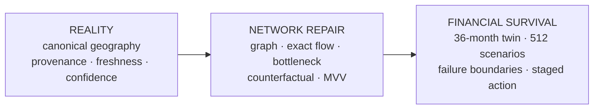

# GramArtha — 60-Second Judge View

> **Start with reality. Repair the network. Test financial survival.**

GramArtha is an evidence-backed hyper-local business feasibility and financial structuring system for **SIH26091**. It does not ask a language model to guess a promising business. It resolves the locality, preserves evidence quality, models the local economic network, identifies a structural gap, searches for the smallest viable repair, and then tests whether that venture survives financial stress.

## The idea in three moves

| 1 · Start with reality | 2 · Repair the network | 3 · Test financial survival |
|---|---|---|
| Resolve a **canonical West Bengal geography** and keep source provenance, freshness and confidence visible. Missing or stale decision-critical evidence is not silently converted into a current fact. | Build the economic graph, evaluate reachable supply/demand, compute **exact flow + residual unserved demand**, detect structural bottlenecks, insert counterfactual venture repairs and search the enumerated **Minimum Viable Venture (MVV)** space. | Route applicable schemes, run the **36-month monthly digital twin**, expose working-capital gaps and failure boundaries, then compare **512 deterministic seeded scenarios** with robust/minimum-regret logic before recommending staged action. |



## What the entrepreneur sees vs. what the engine computes

| Product stage | What the entrepreneur sees | What GramArtha computes underneath |
|---|---|---|
| **1 · Setup** | Locality, available capital and planning profile | Canonical geographic identity, scoped search context and entrepreneur constraints |
| **2 · Local Market** | Local evidence, spatial context and confidence/freshness cues | Provenance-preserving evidence retrieval, OSM/catchment context and decision-readiness checks |
| **3 · Opportunities** | Candidate opportunities and why they exist | Economic graph construction, exact flow, residual demand, bottleneck detection and candidate graph repairs |
| **4 · Risk** | Downside, uncertainty and failure information | 512 deterministic seeded joint scenarios, survival/payback summaries, numerical failure boundaries, VaR/CVaR and regret metrics |
| **5 · Plan** | Smallest viable operating plan rather than a generic category | Counterfactual recomputation, cannibalization accounting, venture primitives and exact search over the enumerated MVV library |
| **6 · Finance** | Scheme fit, monthly cash reality, break-even/payback and working-capital needs | Explicit scheme/rule checks, loan arithmetic and the 36-month month-by-month financial digital twin |
| **7 · Action** | Staged launch and expansion triggers | Frozen decision output, measurable triggers and multilingual/web/PDF presentation |

## The AI boundary

```text
natural-language input
        │
        ▼
optional language structuring
        │
        ▼
┌────────────────────────────────────────────┐
│       EVIDENCE + MATHEMATICAL CORE         │
│ geography → graph → flow → MVV → finance  │
│ uncertainty → robust selection             │
└────────────────────────────────────────────┘
        │
        ▼
frozen VentureDecision
        │
        ▼
optional multilingual explanation
```

Language AI may help structure intake or explain the frozen result. It must not invent market evidence, perform hidden loan arithmetic, silently replace the selected venture, or convert uncertain evidence into certainty.

## What a judge can verify quickly

- **53,537** geographic identities in the audited implementation snapshot.
- **381,523** locality evidence records and **976** regional priors.
- Exact graph/flow, bottleneck, counterfactual and enumerated MVV modules in `backend/engine/`.
- **36-month** monthly financial simulation and working-capital logic in `backend/finance/`.
- **512** deterministic seeded uncertainty scenarios in the deep analysis path.
- **68/68** automated tests passing, with measured backend coverage and CI quality gates.
- Hosted product plus the verified `v0.7.2` downloadable Judge Package.

## Important boundaries

GramArtha is strongest when its restraint is visible. It does **not** claim that every village has complete current economic observations, that the 512 scenario probabilities are empirically calibrated, that the MVV search is a general-purpose optimizer over every imaginable business configuration, or that scheme screening implies lender approval.

For the full five-minute route, continue to [`SIH_JUDGE_WALKTHROUGH.md`](SIH_JUDGE_WALKTHROUGH.md). For implemented vs. bounded surfaces, see [`IMPLEMENTATION_STATUS.md`](IMPLEMENTATION_STATUS.md) and [`LIMITATIONS.md`](LIMITATIONS.md).

---

**The judge-level takeaway:** GramArtha does not generate a business idea first and justify it afterward. It starts from evidence, computes a structural repair, and then asks whether that repair survives financial reality.
